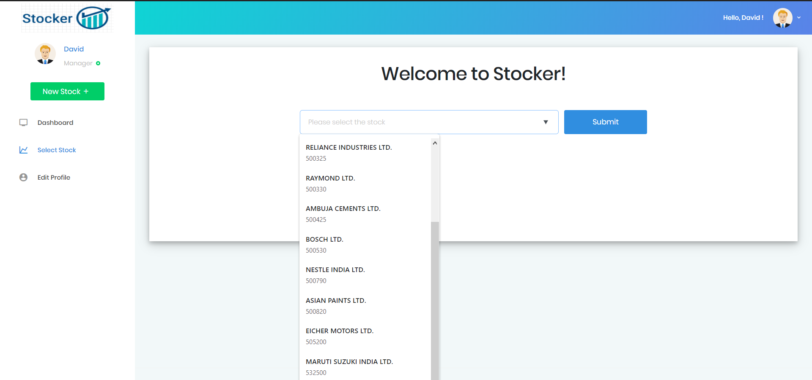

# Title: Stocker
## Description:
**Stocker**, as the name suggests was built with an approach to try and predict stock prices. Although, accurate stock price prediction is still far fetched due to several volatile parameters, here is an attempt to predict the same. I have used **Artificial Neural Network** and deep learning libraries like Keras, TensorFlow and accomplished the prediction of stock market prices with **80%** plus accuracy for a span of one week by building and training the mode on **Bombay Stock Exchange(BSE)** stocks.

