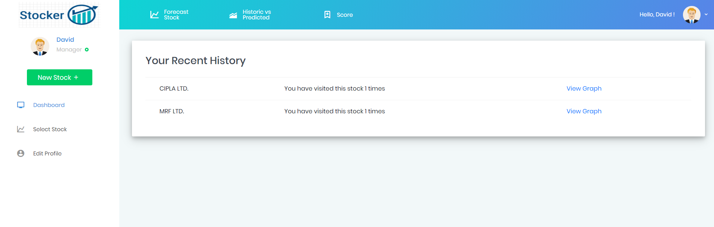
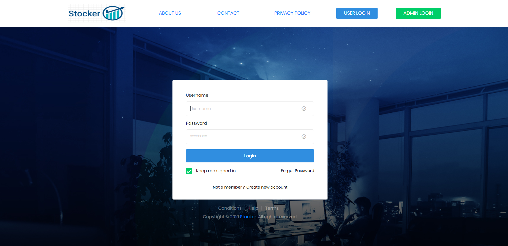
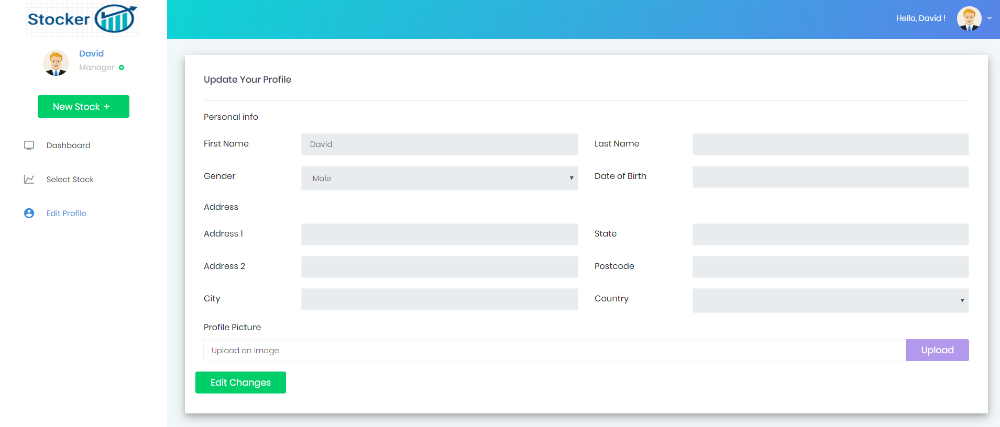

# Stocker
## Summary:
`**Stocker**, as the name suggests was built with an approach to try and predict stock prices. Although, accurate stock price prediction is still far fetched due to several volatile parameters, here is an attempt to predict the same. I have used **Artificial Neural Network** and deep learning libraries like Keras, TensorFlow and accomplished the prediction of stock market prices with **80%** plus accuracy for a span of one week by building and training the mode on **Bombay Stock Exchange(BSE)** stocks.`
   

This is the landing page of the project wherein the user can see his/her stock history and view its prediction graph.
   

The user is able to login via this page
   

The user has the options to change his/her personal details in this editprofile page.
  

This page is restricted only for the Admin user and the Admin user has the access to add or remove new stocks in the existing current stock list.
  

  

  

  

  

