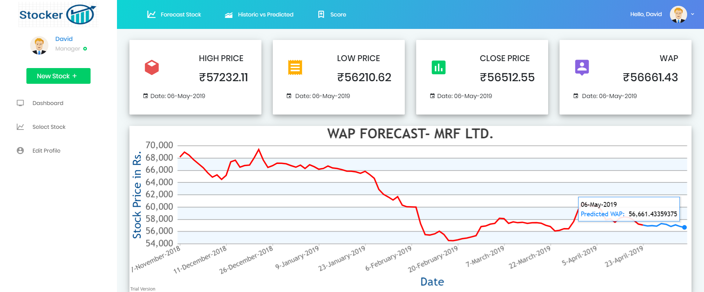

# Stocker
## Summary:
`**Stocker**, as the name suggests was built with an approach to try and predict stock prices. Although, accurate stock price prediction is still far fetched due to several volatile parameters, here is an attempt to predict the same. I have used **Artificial Neural Network** and deep learning libraries like Keras, TensorFlow and accomplished the prediction of stock market prices with **80%** plus accuracy for a span of one week by building and training the model on the **Bombay Stock Exchange(BSE)** dataset of stocks.`
    

`This is the landing page of the project wherein the user can see his/her stock history and view its prediction graph.`
    

`The user is able to login via this page.`
    

`The user has the options to change his/her personal details in this editprofile page.`
    

`This page is for Admin login and is restricted only for the Admin user who has the access to add or remove new stocks in the existing current stock list.`
    

`This is the main page of the website wherein the user has the option to select the stocks for which he wishes to see the prediction.`

    

`This page displays some of the stocks along with its name and ID. These stocks are taken from BSE(Bombay Stock Exchange).`
    

`After the user selects the stock for which he/she wishes to see the predicted price of that particular stock, the user is provided with **High Price, Low Price, Closing Price and Weighted Average Price(WAP)**. The main objective is to provide the user with value of the stock which is the Weighted Average Price in this case.`
    

`As one can see, the Y-axis displays the price in Indain Rupees and the X-axis displays the time period ie. Date. The graph displayed on the page is divided into 2 parts:-
1. Actual Data - The data which is represented with the red color is the actual data on which the model has trained.`
`2. Forecasted Data - The data which is represented with blue color which is the predicted data which the end user desires.`

`Here, the actual data is till 22nd April 2019 as indicated on the graph provided in the image.`
    

`This image displays the date with which the end user is provided the predicied prices with. In this case, the end user is provided with predicted prices till 6th May 2019. The prediction does not take the weekends into cosnideration as the stock market is closed on those days.`
    

